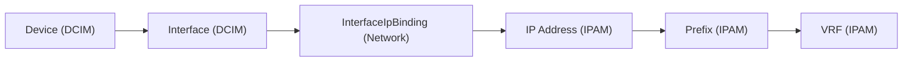
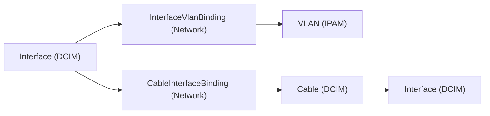
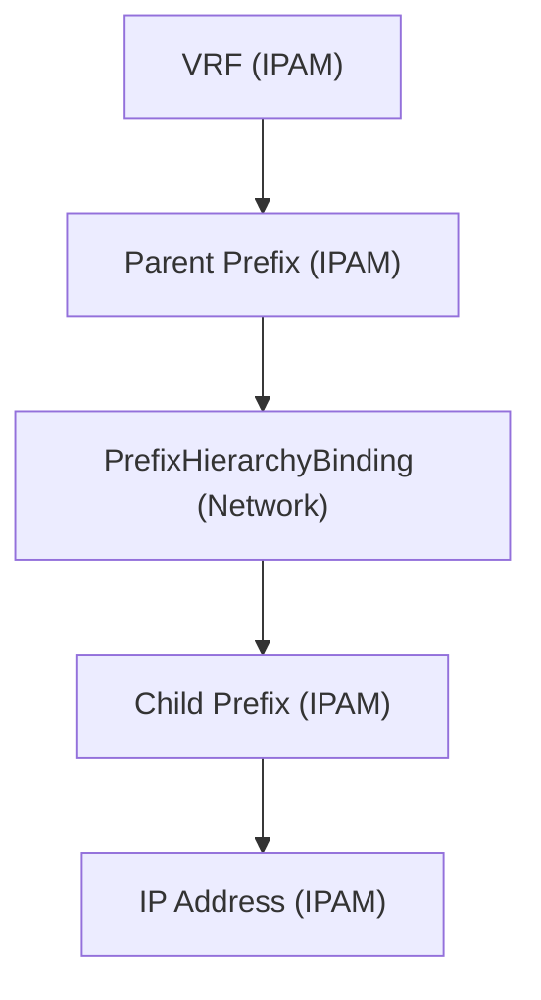

# Cross-Domain Data Flow Diagrams

## Interface and Address Binding

```mermaid
graph LR
  D["Device (DCIM)"] --> I["Interface (DCIM)"]
  I --> B1["InterfaceIpBinding (Network)"]
  B1 --> IP["IP Address (IPAM)"]
  IP --> P["Prefix (IPAM)"]
  P --> V["VRF (IPAM)"]
```

## VLAN and Cabling Relationships

```mermaid
graph LR
  I1["Interface (DCIM)"] --> B2["InterfaceVlanBinding (Network)"]
  B2 --> VLAN["VLAN (IPAM)"]
  I1 --> B3["CableInterfaceBinding (Network)"]
  B3 --> C["Cable (DCIM)"]
  C --> I2["Interface (DCIM)"]
```

## Prefix Hierarchy

```mermaid
graph TD
  V["VRF (IPAM)"] --> PR["Parent Prefix (IPAM)"]
  PR --> H["PrefixHierarchyBinding (Network)"]
  H --> CP["Child Prefix (IPAM)"]
  CP --> IP["IP Address (IPAM)"]
```
