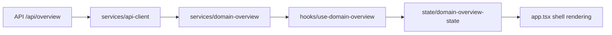

# UI Data Flow

The InfraLynx UI data layer is structured to keep transport, normalization, state, and rendering responsibilities separate.

## Flow Rules

- transport concerns stay in services
- normalization happens once per response
- hooks coordinate asynchronous loading and retry behavior
- reducer state defines loading, ready, and error transitions
- components render from normalized state only

## Benefits

- clearer failure boundaries
- lower coupling to backend schemas
- easier future expansion to caching, invalidation, and mutation workflows
